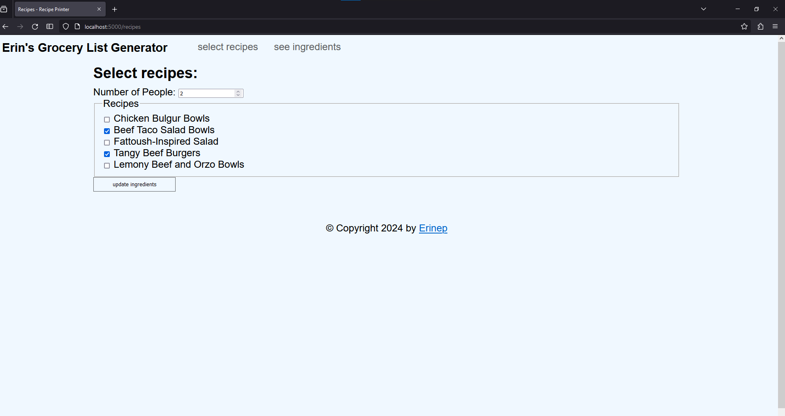
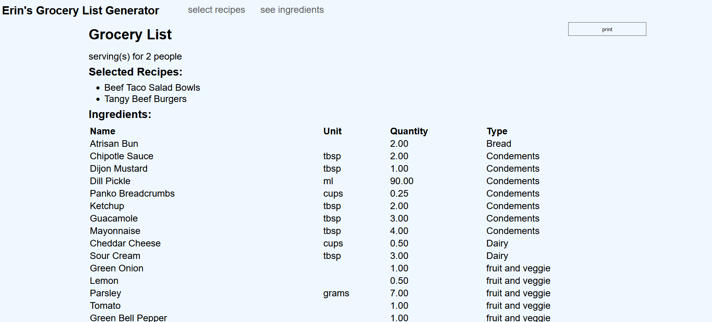

# Grocery List Generator

Web server and CLI tool to generate a Grocery Shopping list

## Instructions

Set config variables in a .env file. It should contain the following parameters:
```
DB_HOST="example-database-url"
DB_NAME="example-database-name"
DB_USER="example-database-user"
DB_PASS="example-database-password"

SESSION_KEY="super_secret_key_phrase"
```

- Use create_tables.sql file to populate your postgress server
- navigate to project root (`cd <PROJECT-ROOT>`)
- setup your db config parameters in ./recipeprinter/__main__.py
- Dev build commands: `pip install -e . ; python -m recipeprinter` 
- Create python wheel using `python -m build` (and run it using: `pip install <PATH-TO-WHL-FILE> ; python -m recipeprinter`)

### web server (still figuring this out...)

1. launch virtual environment (windows): `python -m venv venv`, `venv/scripts/activate.ps1`
2. install this app: `pip intall .`
3. dev server launch `flask --app precipeprinter run`
4. install production WSGI server: `pip install waitress`
5. launch production server on local host: `waitress-serve --host 127.0.0.1 recipeprinter:app`
6. add NGINX or httpd reverse proxy to route to port 80 or 443

## Web server example

to launch the web server use the termial command: `waitress-server --host <IP address> recipeprinter:app`





## Command line interface example

to lauch the program use the terminal command: `python -m recipeprinter`


### Sample user input

```

Please select recipes to add to your cart

RECIPE LIST
 1. [ ] Chicken Bulgur Bowls
 2. [ ] Beef Taco Salad Bowls
 3. [ ] Fattoush-Inspired Salad
 4. [ ] Tangy Beef Burgers
 5. [ ] Lemony Beef and Orzo Bowls

enter recipe number (or 'c' to checkout): 1

RECIPE LIST
 1. [x] Chicken Bulgur Bowls
 2. [ ] Beef Taco Salad Bowls
 3. [ ] Fattoush-Inspired Salad
 4. [ ] Tangy Beef Burgers
 5. [ ] Lemony Beef and Orzo Bowls

enter recipe number (or 'c' to checkout): 6
invalid item. Please try again

RECIPE LIST
 1. [x] Chicken Bulgur Bowls
 2. [ ] Beef Taco Salad Bowls
 3. [ ] Fattoush-Inspired Salad
 4. [ ] Tangy Beef Burgers
 5. [ ] Lemony Beef and Orzo Bowls

enter recipe number (or 'c' to checkout): 5

RECIPE LIST
 1. [x] Chicken Bulgur Bowls
 2. [ ] Beef Taco Salad Bowls
 3. [ ] Fattoush-Inspired Salad
 4. [ ] Tangy Beef Burgers
 5. [x] Lemony Beef and Orzo Bowls

enter recipe number (or 'c' to checkout): c

How many people? (2 or 4) 2

save to './shopping_list_2024-02-17.txt'? (y/n) y

please wait... generating list...
```

### Sample Output:

```
list generated on 2024-02-18
serving(s) for 2 people

Ingredients for the following:
 - Chicken Bulgur Bowls
 - Lemony Beef and Orzo Bowls

ingredient                     unit      qty   type
-----------------------------------------------------------
Mayonnaise                     tbsp      2     Condements
Tomato Sauce Base              tbsp      2     Condements
Sour Cream                     tbsp      3     Dairy     
Feta Cheese                    cups      0.50  Dairy     
Parsley                        grams     7     fruit and veggie
Garlic                         cloves    1     fruit and veggie
Tomato                                   1     fruit and veggie
Baby Tomatoes                  grams     113   fruit and veggie
Baby Spinach                   grams     112   fruit and veggie
Sweet Bell Pepper                        1     fruit and veggie
Lemon                                    2     fruit and veggie
Jalapeno                                 1     fruit and veggie
Bulgur Wheat                   cups      0.50  Grains    
Orzo                           grams     170   Grains    
Chicken Breasts                          2     Protein   
Ground Beef                    grams     250   Protein   
Smoked Paprika Garlic Blend    tbsp      1     Spices    
Garlic Salt                    tsp       1     Spices    
Zesty Garlic Blend             tbsp      1     Spices    

```
